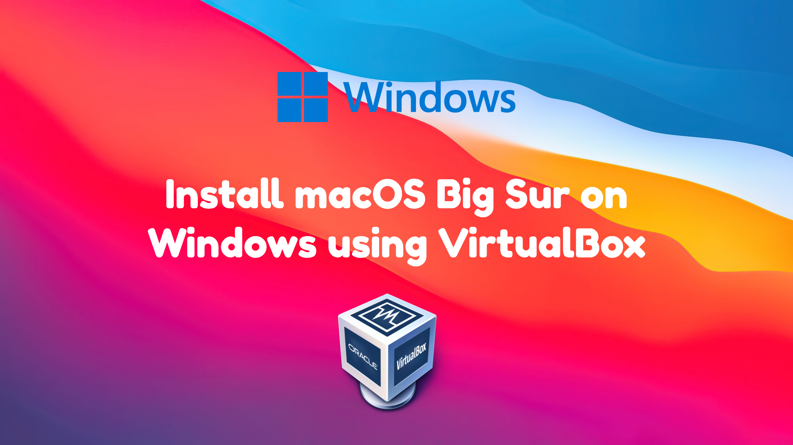

import Giscus from "@giscus/react";

# Install macOS Big Sur 11.6 in Oracle VM VirtualBox (Windows)

**Today we'll guide you how to install macOS Big Sur 11.5 in Oracle VM VirtualBox (Windows)**

<!-- truncate -->

## Prerequisites

- macOS Big Sur ISO File- Download
- VirtualBox - Download (Click on Windows hosts after clicking this link.)
- VirtualBox Extension Package- Download (Click on All supported platforms under Virtualbox x.x.xx Oracle VM VirtualBox Extension Pack
- 4 GB RAM and 200GB Storage for the VM. Should be double the values for Windows System Example: You have to be with 8 GB RAM and Storage more than 500 GB. 4 GB RAM and 200GB Storage for macOS.

## Starting with the guide...

---

## Video Guide

**Subscribe to our Channel:**

<iframe
  src="https://complabs.in/html/subscribe.html"
  title="Subscribe Comp Labs"
  height="100"
></iframe>

## Comments

<Giscus
  id="comments"
  repo="Comp-Labs/comp-labs-website"
  repo-id="R_kgDOGaLmeA"
  category="General"
  category-id="DIC_kwDOGaLmeM4CBAA6"
  mapping="title"
  term="Comments"
  reactions-enabled="1"
  emit-metadata="0"
  input-position="top"
  theme="preferred_color_scheme"
  lang="en"
/>
