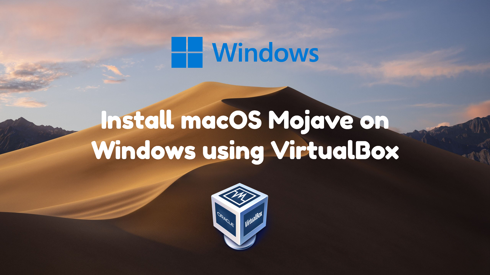
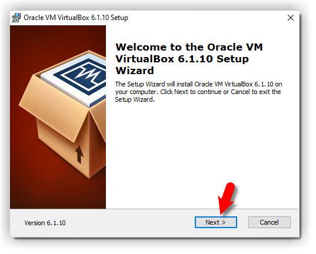
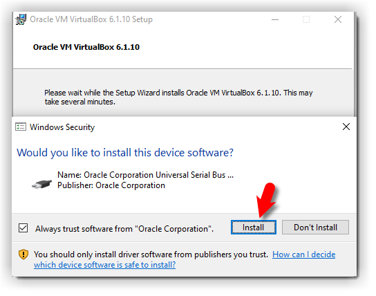
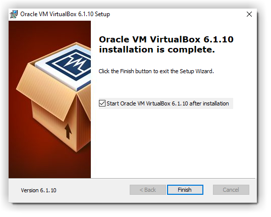
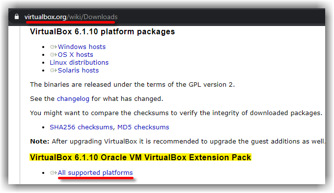
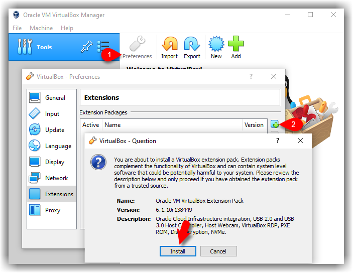
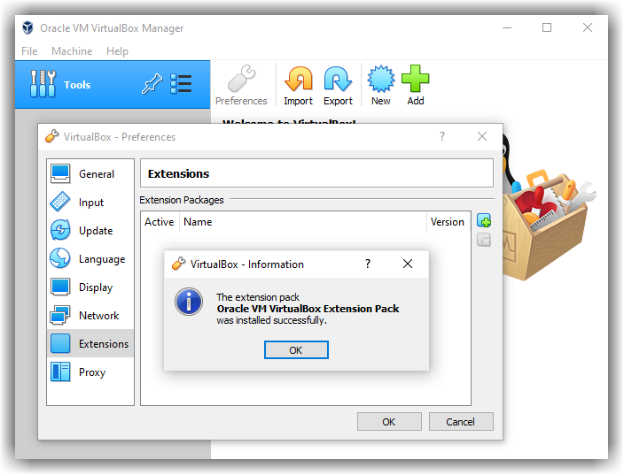
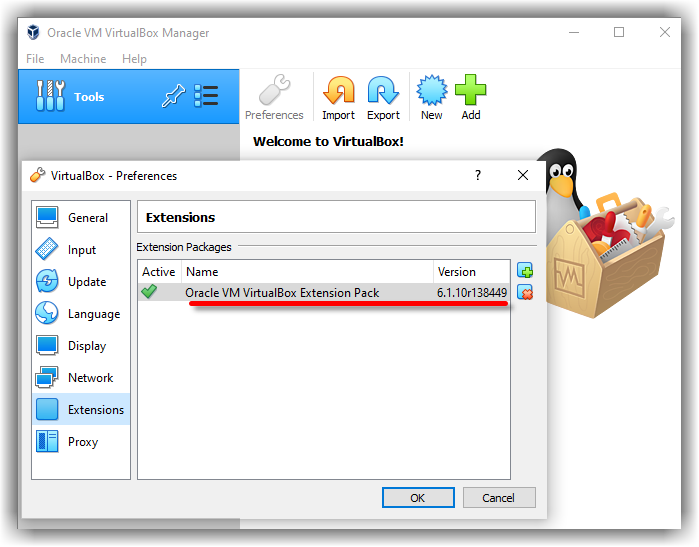

import Giscus from "@giscus/react";

# How to install macOS Mojave 10.14 in Oracle VM VirtualBox (Windows)

<figure>
  </img>
  <figcaption align="center">Image by Author</figcaption>
</figure>

**Today we'll guide you on installing macOS Mojave 10.14 on Windows using VirtualBox**

<!-- truncate -->

## System Requirements

Before we get started, make sure to read the following requirements. Please do not skip this step because it will help you to successfully install macOS Mojave on Windows using VirtualBox.

- Minimum 2 GB memory (Recommended 8GB or higher)
- Minimum 2 cores of processors (Recommended 4 cores or higher)
- Minimum 20GB Free Hard Disk Space (Recommended 100GB or higher)
- Your system should support Intel or AMD VT (Virtualization Technology)
- Intel/AMD VT (Virtualization Technology) Should be enabled from BIOS setup

:::note Required

If you haven't already, then you should enable Virtualization Technology (Also known as Intel VT or AMD-V).

:::

Furthermore, it's highly recommended that you install macOS Mojave on SSD **(Solid State Drive)** instead of HDD **(Hard Disk Drive)** because you will have a much faster performance with SSD rather than HDD.

## Prerequisites

To install macOS Mojave on Windows using VirtualBox, you must download the following files and read the step by step guide to avoid any problems. If you miss any of the steps below, then you might be unsuccessful in running macOS on your PC.

- Download macOS Mojave ISO
  - [macOS Mojave 10.14.6 (18G9323) ISO Latest](//complabs.in)
  - [Create macOS Mojave ISO Image](/blog/posts/create-iso-file-for-any-macos-release#create-iso-for-macos-mojave)
- Download VirtualBox
  - [VirtualBox Latest Version Setup](//www.virtualbox.org/wiki/Downloads)

## Install VirtualBox on Windows PC

From the [Prerequisites](#prerequisites) section of this post, you should have downloaded VirtualBox and if you didn't, download VirtualBox and install it on your Windows PC. If you've already installed VirtualBox, then you can skip this step. Otherwise, follow the steps below.

1. Open the downloaded VirtualBox setup file.
2. On the Welcome Wizard page, click Next.
3. Keep the default settings on the Custom Setup page and click Next.
4. Again Click Next to accept the default options unless you want to change something.
5. On the Warning Network interface page, just click Yes to process with VirtualBox Installation.
6. Click the Install button to install VirtualBox. Again click Yes if required.
7. While installing VirtualBox, you might a security warning about "Oracle Corporation". You need to click Install on this page to proceed with the installation. If you click Don't install, the installation process will be terminate here and you can't go ahead. If you see the security warning again, click the Install button.
8. Finally, Click Finish.

<figure>
  </img>
  <figcaption align="center">VirtualBox Setup Welcome Wizard</figcaption>
</figure>

<figure>
  </img>
  <figcaption align="center">Windows Security</figcaption>
</figure>

<figure>
  </img>
  <figcaption align="center">VirtualBox Setup Completed</figcaption>
</figure>

## Install & Update VirtualBox Extension (Optional)

This step is not 100% necessary but it's highly recommended to do this step because macOS Mojave might not function properly on VirtualBox. For this reason, it might cause problems during the installation. Go to the VirtualBox download page. Under `VirtualBox x.x.xx Oracle VM VirtualBox Extension Pack` section, click on `All supported platforms` to download the latest version of VirtualBox Extension Pack.

<figure>
  </img>
  <figcaption align="center">Download VirtualBox Extensions</figcaption>
</figure>

Once you've downloaded the Extension pack. Now, Follow the steps below to update the VirtualBox Extension Pack.

1. Open up VirtualBox. Click on `Preferences`. Select `Extensions` on the sidebar.
2. Click on **Plus** (+) icon and select the **VirtualBox extension file** which you've downloaded at the beginning of this section (`Oracle_VM_VirtualBox_Extension_Pack-6.1.34.vbox-extpack`). Click **Install** or **Upgrade** and then **Agree** to the terms and conditions. Click the **OK** button.

Finally, you should see something like the screenshot below.

<figure>
  </img>
  <figcaption align="center">VirtualBox Extension Install</figcaption>
</figure>

<figure>
  </img>
  <figcaption align="center">Oracle VM VirtualBox Extension Pack</figcaption>
</figure>

<figure>
  </img>
  <figcaption align="center">
    Oracle VM VirtualBox Extension Pack Installed
  </figcaption>
</figure>

## Create a New Virtual Machine for macOS Mojave

Creating a virtual machine for macOS Mojave is kind of the same as you create a virtual machine for the Windows or Linux Operating System but with some minor changes. In this post, I'll outline those changes. Follow the steps below to create a new virtual machine for macOS Mojave using the ISO file.

1. Open up VirtualBox and Click on **New**.
2. Click Expert Mode and select the following options then click Create.
3. Name: Type a suitable Virtual Machine Name.
4. Machine Name: Type the Virtual Machine Location as per your wish (a separate drive is recommended).
5. Type: Mac OS X.
6. Version: Mac OS X (64-bit).
7. Memory size: 4096 MB (4 GB) (recommended 8192 MB (8 GB) or higher).
8. Hard Disk: Create a virtual hard disk now.
9. On the create virtual hard disk window, choose the following options.
10. File Location: The default location should be fine unless you want to change to a new location.
11. File Size: You can specify the disk size here.
12. Hard disk file type: VHD (Virtual Hard Disk) format.
13. Storage on physical hard disk: Select the Dynamically allocated option. However, if you want to have a better performance disk then choose a fixed disk. Fixed disk, will allocate the specified size from your host machine immediately. Read more about the [dynamic vs fixed-size disk](https://www.vembu.com/blog/hyper-v-disk-types-fixed-size-dynamically-expanding-and-differencing-disks/).

<figure>
  </img>
  <figcaption align="center">Create macOS Mojave New VM</figcaption>
</figure>

<figure>
  </img>
  <figcaption align="center">Create macOS Mojave VHD Disk</figcaption>
</figure>

## Edit the New Virtual Machine

It's time to edit the new virtual machine to make it work. Select the Name of the Virtual Machine and click on Settings. Now, make the following changes to the macOS Mojave Virtual Machine.

1. Under System > Motherboard, increase the Base Memory to 8192 MB. However, you can use a bit lower memory if your system doesn't have this much RAM.
2. Uncheck Floppy from the Boot Order section.
3. Under the Processor tab, increase the processors to 4 or higher. If you do not have much, you can set it to 2.

<figure>
  </img>
  <figcaption align="center">macOS Mojave Boot Order</figcaption>
</figure>

<figure>
  </img>
  <figcaption align="center">Increase macOS Mojave Processor</figcaption>
</figure>

4. On the Display window, increase the Video Memory to 128MB.

<figure>
  </img>
  <figcaption align="center">Increase macOS Mojave Video Memory</figcaption>
</figure>

5. From the Storage section, click on Empty > DVD icon. Click on Choose a disk file. You should select the macOS Mojave ISO image which you've downloaded from the [Prerequisites](#prerequisites) section of this post. Finally, click OK to close the macOS Mojave Settings window.

<figure>
  </img>
  <figcaption align="center">Browse macOS Mojave ISO Image</figcaption>
</figure>

<figure>
  </img>
  <figcaption align="center">Browsed macOS Mojave ISO Image</figcaption>
</figure>

## Execute the VirtualBox Code by Command Prompt

Once you've created and customized your virtual machine, it's time to run some codes in order to install macOS Mojave on VirtualBox. First, you should note your virtual machine name which you typed because later on, we will use it.

:::note

Before you execute the code by command prompt, you should read the following steps.

:::

**Code: (Copy this code to Notepad)**

```title="VirtualBox Code"
cd "C:\Program Files\Oracle\VirtualBox\"
VBoxManage.exe modifyvm "VM Name" --cpuidset 00000001 000106e5 00100800 0098e3fd bfebfbff
VBoxManage setextradata "VM Name" "VBoxInternal/Devices/efi/0/Config/DmiSystemProduct" "iMac19,1"
VBoxManage setextradata "VM Name" "VBoxInternal/Devices/efi/0/Config/DmiSystemVersion" "1.0"
VBoxManage setextradata "VM Name" "VBoxInternal/Devices/efi/0/Config/DmiBoardProduct" "Mac-AA95B1DDAB278B95"
VBoxManage setextradata "VM Name" "VBoxInternal/Devices/smc/0/Config/DeviceKey" "ourhardworkbythesewordsguardedpleasedontsteal(c)AppleComputerInc"
VBoxManage setextradata "VM Name" "VBoxInternal/Devices/smc/0/Config/GetKeyFromRealSMC" 1
```

1. When you opened the Code via Notepad, use the replace function of the program to replace the "VM Name" with your virtual machine name. See the picture below to get an idea of how to do it.

<figure>
  </img>
  <figcaption align="center">Replace macOS Mojave VM Name</figcaption>
</figure>

2. Now, you have two choices. First, if you want to fix your macOS Mojave screen resolution in the first place. You should also execute the following code. You have to change "VM Name" with your virtual machine name and HxV with a screen resolution such as "1920×1080". For more supported screen resolution on VirtualBox and detailed guide, visit fix macOS Catalina screen resolution on VirtualBox.

```
VBoxManage setextradata "VM Name" VBoxInternal2/EfiGraphicsResolution HxV
```

:::note Important Note

I highly recommend to quit the VirtualBox program before executing the code. If you don't do it, your virtual machine might not proceed to the installation step. To quit, simply open VirtualBox, then press Ctrl + Q. It will close automatically.

:::

<figure>
  </img>
  <figcaption align="center">Exit VirtualBox</figcaption>
</figure>

3. Once you replaced the "**VM Name**" with your virtual machine name, then run the code one by one via command prompt (CMD). You can open the command prompt by pressing the <i class="fa-brands fa-windows"></i> + X key in Windows 10/11 and select Command Prompt from the list. Or simply press Windows key and type CMD. Click Run As Administrator and click Yes.

<figure>
  </img>
  <figcaption align="center">Execute macOS Mojave VirtualBox Code</figcaption>
</figure>

4. Now, that you've executed the macOS Mojave VirtualBox code. Open the VirtualBox app then click the **Start** button to power on the VM. A black screen with a lot of white text will appear on the screen. Just wait for a few minutes and the macOS Mojave installation will start.

<figure>
  </img>
  <figcaption align="center">macOS Mojave Installation</figcaption>
</figure>

## Create macOS Mojave Bootable Disk

Once you start your VM, a whole bunch of code will run on the screen, but you should not be worried about it. Wait for a few minutes, and you should see the macOS Mojave Language window.

1. Select your **Language** and click **Continue** arrow.

<figure>
  </img>
  <figcaption align="center">Select macOS Mojave Language</figcaption>
</figure>

2. Now, you'll see **macOS Utilities** Window. From the list, select **Disk Utility** and click **Continue**.

<figure>
  </img>
  <figcaption align="center">Select Disk Utility</figcaption>
</figure>

3. Select your main **VHD Disk** and click the **Erase** button. Choose the following options and again click **Erase**.

- **Name:** `macOS System` (You can type any name you want)
- **Format:** `APFS` (If you get an error, select Mac OS X Extended Journaled)
- **Scheme:** `GUID Partition Map`

<figure>
  </img>
  <figcaption align="center">Erase VirtualBox Hard Disk</figcaption>
</figure>

4. Now, **Quit** the **Disk Utility** window.

<figure>
  </img>
  <figcaption align="center">Quit Disk Utility</figcaption>
</figure>

5. From macOS Utilities, select **Install macOS** and click **Continue**.

<figure>
  </img>
  <figcaption align="center">Select Install macOS Mojave</figcaption>
</figure>

6. Click **Continue** on Install macOS Mojave screen.

<figure>
  </img>
  <figcaption align="center">Install macOS Mojave</figcaption>
</figure>

7. **Agree** to the macOS Mojave License agreement.
8. Select **macOS System** (Or your Disk Name) and click **Install**.

<figure>
  </img>
  <figcaption align="center">
    Agree to the macOS Mojave License agreement
  </figcaption>
</figure>

<figure>
  </img>
  <figcaption align="center">Install macOS Mojave on Formatted Disk</figcaption>
</figure>

9. Now, wait for 3-7 minutes and your VM will restart. macOS Mojave will be installed on your Disk. Next, you should not do anything. You'll see another 15-29 minutes (or even 1 hour) installation window. Be patient till the macOS Mojave gets installed.

<figure>
  </img>
  <figcaption align="center">Installing macOS Mojave on Disk</figcaption>
</figure>

<figure>
  </img>
  <figcaption align="center">Install macOS while Reboot</figcaption>
</figure>

## Perform a Clean Installation of macOS Mojave

Once you've passed step [Create macOS Mojave Bootable Disk](#create-macos-mojave-bootable-disk), you'll see the macOS Mojave Welcome window. Select the following options. You can change most of the settings later on, so don't worry about it for now.

1. Select your **Country** and click **Continue**.

<figure>
  </img>
  <figcaption align="center">Select your Country</figcaption>
</figure>

2. Choose a **Keyboard** Layout and click **Continue**.
3. On the "Data & Privacy" window, click **Continue**.
4. Select **Don't transfer any information now** and click **Continue**.
5. Click on **Set Up Later** then **Don't Sign In**. Click **Skip**. You can add your Apple ID later.
6. Click **Agree** to the **Terms and Conditions** and click **Continue**.
7. Fill out the **Full name, Account name, Password**, and **Hint** then click **Continue**.

<figure>
  </img>
  <figcaption align="center">Create macOS Mojave Computer Account</figcaption>
</figure>

8. If you want to customize **Express Set Up**, you can click on Customize Settings otherwise click on **Continue**.
9. Dark mode feature is added newly to macOS Mojave 10.14 so you can select **Light** or **Dark** mode then click **Continue**.

<figure>
  </img>
  <figcaption align="center">Choose macOS Mojave Look</figcaption>
</figure>

10. Wait a little while to Setting Up Your Mac. Then you should end up on the desktop of macOS Mojave.

<figure>
  </img>
  <figcaption align="center">macOS Mojave Installation Successful</figcaption>
</figure>

## Conclusion

Finally, you should see the macOS Mojave Wallpaper, and it successfully installs on VirtualBox.

If you have any kinds of questions, suggestions or inquiries on how to install macOS Mojave on Windows using VirtualBox, please feel free to contact us by [email](mailto:complabs28@gmail.com) or by our [contact page](https://forms.gle/dQmrNAZZ1KK81rAP7). We will answer your every question and get your suggestion for our future works. Thanks for being with us.

YouTube Video will be uploaded after some time.

---

## Video Guide

**Subscribe to our Channel:**

<iframe
  src="https://complabs.in/html/subscribe.html"
  title="Subscribe Comp Labs"
  height="100"
></iframe>

## Comments

<Giscus
  id="comments"
  repo="Comp-Labs/comp-labs-website"
  repoId="R_kgDOGaLmeA"
  category="General"
  categoryId="DIC_kwDOGaLmeM4CBAA6"
  mapping="title"
  term="Comments"
  reactionsEnabled="1"
  emitMetadata="0"
  inputPosition="top"
  theme="preferred_color_scheme"
  lang="en"
  loading="lazy"
/>

<br></br>
## Install macOS on Windows using VirtualBox Series

|  	|  	|  	|  	|                                    	|
|:----------------------------------------------------------------------------------------:	|:--------------------------------------------------------------------------------------------:	|:-----------------------------------------------------------------------------------------:	|:--------------------------------------------------------------------------------------------:	|:-------------------------------------------------------------------------:	|
|                   **Install macOS Mojave on Windows using VirtualBox**                   	|                    **Install macOS Catalina on Windows using VirtualBox**                    	|                   **Install macOS Big Sur on Windows using VirtualBox**                   	|                    **Install macOS Monterey on Windows using VirtualBox**                    	|           **Install macOS Ventura on Windows using VirtualBox**           	|
|         [Read Now](/blog/posts/install-macos-mojave-on-windows-using-virtualbox)         	|          [Read Now](/blog/posts/install-macos-catalina-on-windows-using-virtualbox)          	|         [Read Now](/blog/posts/install-macos-big-sur-on-windows-using-virtualbox)         	|          [Read Now](/blog/posts/install-macos-monterey-on-windows-using-virtualbox)          	| [Read Now](/blog/posts/install-macos-ventura-on-windows-using-virtualbox) 	|
