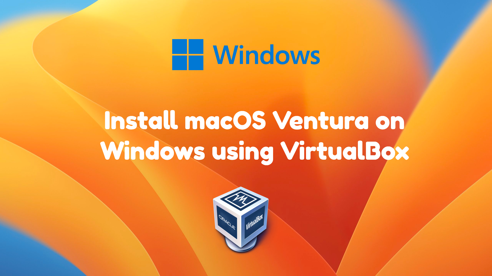

<figure>
  </img>
  <figcaption align="center">Image by Author</figcaption>
</figure>

# Introduction

<!-- truncate -->

**macOS 13** also known as **macOS Ventura** as announced on the 6th June, 2022 in [WWDC22](https://developer.apple.com/videos/wwdc2022/). It's amazing to see that every year, Apple is introducing new products to the market. And this year, **macOS Ventura** comes with the all-new **M2 Chip** preloaded on the new Macs. Compared to the previous versions of macOS, Apple has brought a lot of changes taking from UI to settings. And by the way, did I tell you that from now onwards, **System Preferences** is named as **System Settings** from now on. New settings that look similar to Ubuntu settings have been added. Cool new features are added such as **Stage Manager**, **Spotlight**, Convert your **iPhone** to Webcams, and more. If you are a Windows user, looking forward to testing the new macOS Ventura, perhaps you should consider this guide.

Since Virtualisation is so powerful, it can give you the macOS feel in real-time while using your Windows Apps. After experiencing the operating system, you can give your opinion about the macOS 13. So why you are waiting, let's start the process of Installing macOS Ventura on Windows using VirtualBox.

## Intel VT-x and AMD-V

Make sure that you enable the virtualisation feature also known as Intel VT-x and AMD-V from the BIOS of your computer otherwise you won't be able to run the Virtual Machine. However, if your computer does not support virtualisation technology, then you can't install macOS Ventura. I am afraid you have to purchase a new computer.

To check if your computer supports and has enabled virtualisation technology, there is a simple method that you can use to check right now. And it is to open `Task Manager` > Go to `Performance` Tab > Select `CPU` and check the **virtualisation status** as shown below.

<figure>
  </img>
  <figcaption align="center">Check Virtualisation Status</figcaption>
</figure>

If virtualisation is disabled, follow the below post and enable it from the BIOS of your computer.

[How to Enable Virtualization from BIOS of your computer?](https://www.wikigain.com/enable-virtualization-technology-on-asus-aser-hp-dell-lenovo/)

## Download VirtualBox and Extension Pack

VirtualBox is an open-source virtualization application that you can get it right now and test any operating system that you desire. Aside from VirtualBox, you also need to get the VirtualBox extension pack which will result in solving the issues of the mouse and keyboard. Since both of these open source applications are free, get them right now from [virtualbox.org](//virtualbox.org).

<figure>
  </img>
  <figcaption align="center">Get VirtualBox and VirtualBox Extension Pack</figcaption>
</figure>

It's time to install the downloaded VirtualBox that you've got. Double-click on the VirtualBox Installer and Install it with the default options. There is no need to prepare a step-by-step guide for this section. After that you need to install the VirtualBox Extension, double click on its installer. It will launch `VirtualBox` > Click on `Install` > then scroll down and Agree with the Terms and Conditions.

<figure>
  </img>
  </img>
  </img>
  </img>
  <figcaption align="center">Get VirtualBox and VirtualBox Extension Pack</figcaption>
</figure>

## macOS Ventura ISO

As long as you have the macOS Ventura ISO image, you can perform a clean installation of macOS Ventura in VirtualBox/VMware. The big question is acquiring the MacOS Ventura ISO image. For now, you can get the macOS Ventura ISO image from the below link, but you need to learn how to create these images yourself. So in the future when a new version of the macOS Ventura is released, you can create it yourself rather than downloading it.

[Download macOS Ventura ISO Image](//complabs.in)
[Create macOS Ventura ISO Image](//complabs.in)

## Create a New Virtual Machine

While the installation of the VirtualBox Extension Pack is complete, you must start the creation of a new virtual machine for macOS Ventura. The creating process of a virtual machine for MacOS Ventura is simple except there are some macOS-Specific requirements that you must fulfill.

**Requirements:**

- It is recommended that your PC must have at least 8 GB of RAM. for macOS Ventura. Set at least 4 GB and 4 GB for your PC.
- You must have 4 processor cores. Set at least 2 processor cores and 2 processor cores for your PC.
- By default, 80 GB of storage for macOS Ventura is enough, but it is recommended to make it 150 GB.

Launch VirtualBox and then click on the new button from the top-level menu.

<figure>
  </img>
  <figcaption align="center">Create a New Virtual Machine</figcaption>
</figure>

After clicking on New, a new window will appear which will ask you to enter the details of the new macOS VM. But for now, you have to click on the **Expert Mode** button.

<figure>
  </img>
  <figcaption align="center">Enable Expert Mode</figcaption>
</figure>

The moment Expert Mode is turned on, you have to describe the virtual machine by providing a name for it and then save it to a location where you have access to it and have enough storage space. Make sure that the type has to be `Mac OS X` and the **version** must be `Mac OS X (64-bit)`.

Following that please make sure to at least provide `4GB (4096 MB)` of RAM to the virtual machine.

Finally, at the end click on **Create a virtual hard disk now** and then click on **create**.

<figure>
  </img>
  <figcaption align="center">Enter VM Details</figcaption>
</figure>

After providing details of the new virtual machine, you have to configure the size of the virtual hard drive. In my case, I will be providing at least 150 GB of storage to it.

The Hard Disk type I have selected is VMDK (Virtual Machine Disk) with Dynamically allocated settings.

<figure>
  </img>
  <figcaption align="center">Configure Storage</figcaption>
</figure>

## Configure Virtual Machine Settings

These settings are really important for booting the virtual machine. These settings include the boot order, graphics controller, configuring the amount of processor, adding the macOS Ventura ISO image, and finally enabling `USB 3.0`.

So let's begin by accessing the settings of the macOS Ventura VM on VirtualBox. Click on Virtual Machine > Click on `Settings` from the top-level menu.

<figure>
  </img>
  <figcaption align="center">Access VM Settings</figcaption>
</figure>

First of all, we need to configure the boot order. Go to the `System` tab > `Motherboard` and uncheck the **Floppy** disk. Leave the rest of the settings as default.

<figure>
  </img>
  <figcaption align="center">Configure Boot Order</figcaption>
</figure>

Following the boot order, go to the **Processor** tab and increase the processor count to 2, as in the previous step, leave the rest of the settings as default.

<figure>
  </img>
  <figcaption align="center">Increase Processor Cores</figcaption>
</figure>

Configuring the graphics is another important section that must be configured, so go to the `Display` tab > Increase the video memory to `128 MB`. Then in front of the graphics controller, click on the drop-down menu and choose `VMSVGA`.

<figure>
  </img>
  <figcaption align="center">Graphics Configuration</figcaption>
</figure>

For the next step, we have to attach the macOS Ventura ISO image to the virtual machine. To add it, go to the `Storage` tab > click on `Empty` > then click on the **CD Icon** and choose a **disk file**. After that, you have to locate the [downloaded](#iso) ISO and attach it to the virtual machine.

<figure>
  </img>
  <figcaption align="center">Add macOS Ventura ISO Image</figcaption>
</figure>

And finally, you must enable the USB 3.0 from the USB category, enabling USB 3.0 will resolve the issue (mouse and keyboard are not working) of the mouse and keyboard.

<figure>
  </img>
  <figcaption align="center">Enable USB 3.0</figcaption>
</figure>

Finally, once you are done with configuring the settings of the VirtualBox for MacOS Ventura, click OK then go to the File menu and choose exit.

<figure>
  </img>
  <figcaption align="center">Exit VirtualBox</figcaption>
</figure>

## VirtualBox Config Commands

There are some necessary codes that must be executed on the Command Prompt. If the code is not executed, macOS Ventura VM will not boot. So you have to get the [VirtualBox Code](#code) that is needed and then bring the necessary changes to the code and then execute it on Command Prompt. The necessary configuration means that you have to replace "VM name" with the name of the virtual machine that you created. And the code for Intel processor and AMD processor are a bit different, depending on your processor, apply the code.

The easiest way is to copy the codes into a **Notepad File**, then go to the **edit menu** and click on **replace**. Type VM name to find it and then replace it with the virtual machine name.

<figure>
  </img>
  <figcaption align="center">Replace VM Name</figcaption>
</figure>

The moment your changes to the code is done, open Windows Search (<i class="fa-brands fa-windows"></i> + S) and search for Command Prompt and run it as Administrator.

<figure>
  </img>
  <figcaption align="center">Run Command Prompt as Administrator</figcaption>
</figure>

Execute all the commands line by line on Command Prompt.

<figure>
  </img>
  <figcaption align="center">Replace VM Name</figcaption>
</figure>

## Install macOS Ventura

This is the final and important step which is about formatting your virtual hard drive and then installing macOS Ventura on it. Obviously, you have to launch VirtualBox, select your macOS VM, and then click on **Start**.

<figure>
  </img>
  <figcaption align="center">Power on the VM</figcaption>
</figure>

After the virtual machine is powered on, a bunch of code will appear on your screen which means that currently, it is trying to boot macOS Ventura. If everything goes well, you will be on the macOS Installation Welcome Page, the first step would be to set your preferred language and then move on.

<figure>
  </img>
  <figcaption align="center">Choose a Language</figcaption>
</figure>

At the moment, you are on the macOS Recovery screen where you can see a bunch of options. But since we are trying to partition the virtual hard drive, you have to select **Disk Utility** and click on **Continue**.

<figure>
  </img>
  <figcaption align="center">Select Disk Utility</figcaption>
</figure>

On the left panel of the disk utility, click on "VBOX HARDDISK Media", then click on **Erase**.

<figure>
  </img>
  <figcaption align="center">Click on Erase Disk</figcaption>
</figure>

You have to erase the virtual hard drive based on the settings below. For this step, I will go with the default macOS Ventura settings.

| **Name** | **Format** | **Scheme** |
| -------- | ----------- | ---------- |
| Your Wish | APFS | GUID Partition Map |

<figure>
  </img>
  <figcaption align="center">Erase Disk</figcaption>
</figure>

When the disk is erased, you have to quit the disk utility by clicking on **Disk Utlity** from the top and click on **Quit Disk Utility**. And once again, you will be on the recovery screen. This time instead of disk utility, you have to choose "Install macOS 13 Beta".

<figure>
  </img>
  <figcaption align="center">Click on Install macOS 13</figcaption>
</figure>

For the nextt step, click on **Continue**.

<figure>
  </img>
  <figcaption align="center">Install macOS 13</figcaption>
</figure>

You have to agree with the Software License Agreement of macOS Ventura by clicking on **Agree**.

<figure>
  </img>
  <figcaption align="center">Agree Terms and Conditions</figcaption>
</figure>

In this final step, you have to select the drive name which you formatted earlier and then click on **Continue**.

<figure>
  </img>
  <figcaption align="center">Select Disk</figcaption>
</figure>

For the next step, you have to be patient because several times it's going to restart the virtual machine and at least it will be taking around 45 mins to even 3 hours to complete based on your computer speed.

<figure>
  </img>
  <figcaption align="center">Wait</figcaption>
</figure>

## macOS Ventura Setup

After the final result of Installing macOS Ventura on VirtualBox, you have to configure the basic user settings just like as you setup your new mobile.

1. For the first step, please select your country.

<figure>
  </img>
  <figcaption align="center">Select Your Country or Region</figcaption>
</figure>

2. Based on the country that you have selected, the commonly spoken languages will be added and all you have to do is click continue.

<figure>
  </img>
  <figcaption align="center">Written and Spoken Languages</figcaption>
</figure>

3. Accessibility is the other feature that you have to click not now and move on.

<figure>
  </img>
  <figcaption align="center">Accessibility</figcaption>
</figure>

4. Configure the network settings by selecting **Loacl Network (Ethernet)**. If there is some problem, try to fix it, or tell me, or select **My computer does not connect to he internet** and continue.
5. Ignore the warning which is saying your computer is not connected to the Internet and move on.

<figure>
  </img>
  <figcaption align="center">Internet Settings</figcaption>
</figure>

6. Please read about the Apple Data & Privacy regarding using macOS Ventura. Once you did click on **Continue**.

<figure>
  </img>
  <figcaption align="center">Data \& Privacy </figcaption>
</figure>

7. On the migration page, you have to click on "Not Now" because we are performing a clean installation.

<figure>
  </img>
  <figcaption align="center">Migration Assistant</figcaption>
</figure>

8. Read the terms and conditions about using macOS on your computer and sharing its data with apple and then click agree.
9. Again click on the agree button.

<figure>
  </img>
  </img>
  <figcaption align="center">Terms and Conditions</figcaption>
</figure>

10. At the moment we are not connected to the internet, that's why you need to create a local user account.

<figure>
  </img>
  <figcaption align="center">Create User Account</figcaption>
</figure>

11. Enable Location Services on macOS Ventura by checking the box and click on **Continue**.

<figure>
  </img>
  <figcaption align="center">Enable Location Services</figcaption>
</figure>

12. Select your Time Zone by entering your current time zone and click on **Continue**.

<figure>
  </img>
  <figcaption align="center">Select Time Zone</figcaption>
</figure>

13. On the Analytics Page, click on **Continue**.

<figure>
  </img>
  <figcaption align="center">Analytics</figcaption>
</figure>

12. If you are using Screen Time, you can configure it from the installer page too, or once the installation is completed, launch the app and set it up.

<figure>
  </img>
  <figcaption align="center">Screen Time</figcaption>
</figure>

13. Choose the theme that you prefer.

<figure>
  </img>
  <figcaption align="center">Theme</figcaption>
</figure>

14. And Best of luck using macOS Ventura your PC.

<figure>
  </img>
  <figcaption align="center">Installation Complete!</figcaption>
</figure>

## Conclusion

I am 100% sure that after testing and experiencing macOS Ventura, you will learn something new. The design, animations, launch tab, stage manager, tabs, and spotlight updates are all bringing those new vibes. Perhaps after testing and Learning How to Install macOS Ventura, you may be considering switching to macOS forever. In the end, I am hoping that you have not faced any difficulties during the installation of the macOS Ventura on VirtualBox. And let me know your thoughts about the macOS Ventura in the comment section.
